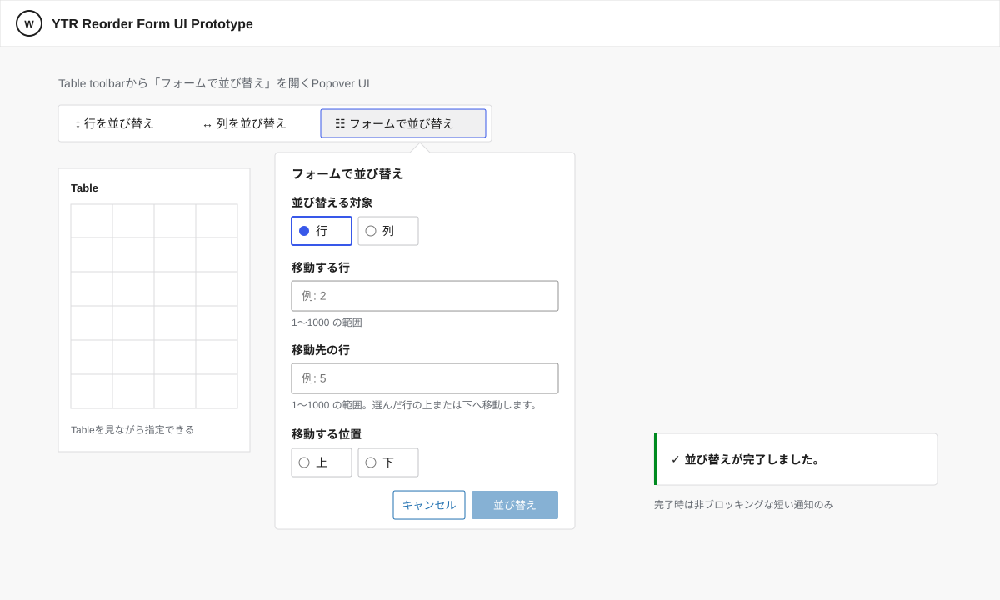

# Reorder Form v1 基本設計書

## 1. 目的

本書は、Reorder Form（RF）v1について、利用者から見える画面、操作、状態、メッセージ、振る舞いを定義する。

RF固有の要件は`docs/requirements/reorder-form-v1-requirements.md`、DnDとRFに共通するReorder v1要件は`docs/requirements/reorder-v1-requirements.md`を正本とする。

データ保持、構造保持、Undo、対応Table Block、反映に時間がかかる場合、並び順が変わらない場合、反映を完了できない場合など、RFにも適用される共通要件に従う。

Keyboardのみでの操作、focus、announcement、支援技術への情報提供など、別要件として扱うアクセシビリティ設計は本書の対象外とする。

## 2. 基本方針

RFはDnDの補助操作ではなく、行または列を指定し、移動先となる行または列との位置関係を指定して直接並び替える独立した手段とする。

利用者は、対応するTableからRFを開始し、次を指定して並び替える。

- 行または列のどちらを並び替えるか
- 移動する行または列
- 移動先の行または列
- 行の場合は移動先の行の上または下、列の場合は移動先の列の左または右

利用者に示す位置番号は`1`から始める。

行では`tbody`の先頭行を`1`とし、列ではTableの左端の列を`1`とする。

「移動先の行」「移動先の列」として指定した位置番号は、並び替え前のTable上で指定した対象を表す。移動対象を取り除いたことで位置番号が変わる場合でも、指定した対象そのものとの位置関係を維持して並び替える。

たとえば2行目を5行目の下へ移動した場合、並び替え前に5行目だった行の直後へ移動する。

## 3. RFの入口と他の並び替え手段との排他

対応するTableを選択している場合、TableのツールバーにRFの入口を表示する。

RFの入口は「行を並び替え」「列を並び替え」と同じ並び替え操作のまとまりに配置し、「列を並び替え」の隣に表示する。

入口には次のツールチップを表示する。

| 言語 | 表示 |
| --- | --- |
| 日本語 | フォームで並び替え |
| English | Reorder with form |

RFの入口を選択すると、そのTableを対象とするRFの入力画面をPopoverとして表示する。PopoverはTableを覆い隠さず、利用者がTableを確認しながら指定できる位置に表示する。

RFの入口も、`reorder-v1-design.md`で定義する共通の初回案内における並び替え入口として扱う。

行並び替えモードまたは列並び替えモードが有効な状態でRFを開始した場合は、現在の並び替えモードを終了してからRFを開始する。

RFの入力画面を表示している間は、同じTableに対する行DnDまたは列DnDを同時に有効にしない。

RFを終了した場合、RF開始前に有効だった行または列の並び替えモードを自動的には再開しない。

## 4. RFの入力画面

RFの入力画面では、現在対象としているTableを並び替えるために必要な指定を行えるようにする。

画面構成と操作イメージは次のプレビューおよびプロトタイプを参照する。

- [RF v1 UIプロトタイプ](./prototypes/reorder-form-v1-ui.html)

プロトタイプは画面構成と操作感を確認するための参考資料とし、要件および正式な画面仕様は本設計書を正本とする。

### 4.1 並び替える方向

「行」と「列」をラジオボタンで表示し、一つだけ選択できるようにする。

初期表示では「行」を選択した状態とする。

利用者が「行」または「列」を選択した時点で、選択した方向の入力フォームへ直ちに切り替える。別の確定操作を必要としない。

方向を切り替えた場合は、切り替え前の方向に対する構造上の移動不可表示や並び順が変わらないことを示す案内を引き継がない。

### 4.2 行を選択した場合

次を指定できるようにする。

- 移動する行
- 移動先の行
- 移動先の行の「上」または「下」

「移動する行」と「移動先の行」は位置番号を数値で入力する。

「上」と「下」はラジオボタンで表示し、一つだけ選択できるようにする。

行番号の入力欄には、現在の`tbody`に存在する行の位置範囲と、有効な入力が整数であることを常に表示する。

たとえば100行ある場合は、`1〜100の整数`を指定できることを示す。不正な値を入力した場合でも、この有効条件の表示を維持する。

「移動先の行」には、選んだ行の上または下へ移動することが分かる補足を表示する。

### 4.3 列を選択した場合

次を指定できるようにする。

- 移動する列
- 移動先の列
- 移動先の列の「左」または「右」

「移動する列」と「移動先の列」は選択肢から選択する。

列にヘッダーがある場合は、ヘッダー名と列番号をあわせて表示する。たとえば`商品名（3列目）`のように表示する。

同じ見出しが複数ある場合でも列番号によって一意に識別できるようにする。

ヘッダーがない列またはヘッダーが空の列は、列番号で識別できる表示とする。たとえば`3列目`のように表示する。

「左」と「右」はラジオボタンで表示し、一つだけ選択できるようにする。

「移動先の列」には、選んだ列の左または右へ移動することが分かる補足を表示する。

### 4.4 初期表示

RFの入力画面を開いた直後は、未入力または未選択であることを理由とするエラーメッセージを表示しない。

必要な指定が揃うまでは「並び替え」を実行できない状態にする。

### 4.5 確定とキャンセル

入力画面には、指定した内容で並び替えを実行する「並び替え」と、RFを終了する「キャンセル」を表示する。

キャンセルした場合はTableのデータを変更せず、RFを終了する。

並び替えを実行する場合は、指定内容が有効であり、Tableの構造上も成立することを確認してから反映へ進む。

## 5. 入力値の扱い

行の位置番号は、表示されている範囲内の整数だけを有効な位置として扱う。

次の指定は有効な位置として扱わない。

- 未入力
- 整数として解釈できない値
- `1`未満の値
- 現在存在する行数を超える値

未入力、未選択、または有効な位置として解釈できない値が残っている間は、「並び替え」を実行できない状態にする。

これらの入力状態について、入力内容に応じた動的なエラーメッセージは表示しない。行番号の入力欄に常時表示する現在の有効条件と「並び替え」を実行できない状態を組み合わせ、利用者が指定を修正する必要があることを認識できるようにする。

列は現在存在する列から選択するため、存在しない列番号や解釈できない文字列を利用者が直接入力する方式にはしない。Tableの変化などによって選択済みの列が現在の選択肢に存在しなくなった場合も、「並び替え」を実行できない状態にする。

有効に解釈できない指定または未選択の指定が残っている間は並び替えを反映せず、Tableのデータを変更しない。

入力値を内部でどのように検証、正規化、サニタイジングするかは、本書では規定しない。

## 6. Table構造上成立しない指定

入力された指定自体は有効であっても、結合セルなどのため、その行または列を指定した位置へ移動するとTableの構造を保持できない場合は並び替えを反映しない。

移動対象、移動先の行または列、上下または左右の指定が揃った時点で構造上成立しないことを判断できる場合は、「並び替え」を実行する前でも、その時点で移動できないことと理由を入力画面上に表示する。

結合セルが理由の場合は、移動を妨げる結合セルのうち最初に確認された1つについて、その位置が分かるように行と列の範囲を表示する。

表示例:

`3〜4行目、2〜3列目に結合セルがあるため、移動できません。`

1行または1列だけに収まる範囲では、不要な範囲表現を省略して位置を示す。

利用者が移動対象、移動先、上下または左右の指定を変更した場合は、それまで表示していた構造上の移動不可メッセージを自動的に終了する。変更後の指定でも移動できないことを判断できる場合は、新しい指定に対応する理由を表示する。

Tableのデータは変更しない。

この場合は「並び替え」を実行できない状態にする。

## 7. 並び順が変わらない指定

移動対象と移動先の指定が有効であっても、並び替え後の順序が現在と変わらない場合はTableのデータを変更しない。

指定が揃った時点で並び順が変わらないことを判断できる場合は、「並び替え」を実行する前でも入力画面上で案内する。

表示例:

`この指定では並び順は変わりません。`

利用者が指定を変更した場合は、それまでの案内を自動的に終了する。変更後も並び順が変わらない場合は、現在の指定に対応する案内を表示する。

この場合は「並び替え」を実行できない状態にし、不要なデータ更新やUndo履歴を作らない。

## 8. 並び替えの反映

有効な移動対象、移動先の行または列、および上下または左右が指定され、Tableの構造上も成立する場合に並び替えを反映する。

行の場合は`tbody`内の行順だけを変更する。

列の場合はTable全体の列順だけを変更する。

セルの内容、属性、装飾その他の保持すべき情報は変更しない。

一回のRFによる並び替えは、一回のUndo操作で並び替え前の順序へ戻せるようにする。

## 9. 反映に時間がかかる可能性がある場合

並び替えの反映に時間がかかる可能性があると判断された場合は、反映を開始する前に、続行するか中止するかを選択できる確認を表示する。

利用者が続行を選択した場合だけ反映を開始する。

中止した場合はTableのデータを変更せず、入力内容を保持したRFの入力画面へ戻る。

反映に時間がかかる可能性を判断する具体的な条件は、本書では規定しない。

## 10. 反映中

並び替えの反映を開始した後は、対象のTableを編集できない状態にする。

対象のTable以外のブロックについては、通常どおり編集や操作を続けられるようにする。

反映が短時間で完了した場合は、不要な処理中表示を行わない。

反映が一定時間内に完了しない場合は、対象のTableで処理が続いていることを利用者が確認できるようにする。

表示例:

`反映中です。`

反映中であることを示す表示によって、対象Table以外のブロックの操作を妨げない。

一定時間の具体的な基準は、本書では規定しない。

## 11. 並び替え完了の確認

並び替えが完了したらRFの入力画面を終了し、通常のTable編集を妨げない短い完了通知を表示する。

完了通知には、正常に反映されたことを視覚的に確認できる控えめな成功アイコンを添え、次のメッセージだけを表示する。

| 言語 | メッセージ |
| --- | --- |
| 日本語 | 並び替えが完了しました。 |
| English | Reordering complete. |

完了通知のために利用者へ追加の確定操作や閉じる操作を要求しない。

並び替え後のTableは通常の編集状態で表示する。

## 12. 反映を完了できない場合

並び替えの反映を完了できなかった場合は、途中まで反映された状態を並び替え結果として残さない。

Tableは並び替え開始前の状態を保つ。

利用者には、並び替えを完了できなかったことを短いメッセージで知らせる。

表示例:

`並び替えを反映できませんでした。Tableは変更されていません。`

反映失敗後は、入力内容を保持したRFの入力画面へ戻し、利用者が指定を修正または再実行できる状態にする。

対象のTableも再び編集できる状態に戻す。

## 13. 対応Table Block

RFは、Reorder v1が対応する次のTable Blockで同じ操作方針とする。

- WordPress Core Table
- Flexible Table Block

Table Blockの違いによって、RFの基本的な入力方法や利用者に示す位置番号の意味を変更しない。

## 14. 要件との対応

| 要件ID | 基本設計 |
| --- | --- |
| RF-FR-01 | 2、4、5 |
| RF-FR-02 | 2、4、5 |
| RF-FR-03 | 2、4、8 |
| RF-FR-04 | 11 |
| RF-FR-05 | 5 |
| RF-FR-06 | 3 |
| RF-FR-07 | 3 |
| FR-03 | 8 |
| FR-04 | 6、8 |
| FR-05 | 4、5、6、9、12 |
| FR-06 | 8 |
| FR-07 | 3 |
| FR-08 | 4 |
| FR-09 | 3 |
| FR-13 | 13 |
| FR-17 | 6 |
| FR-18 | 9 |
| FR-19 | 10 |
| FR-20 | 10 |
| FR-21 | 7 |
| FR-22 | 12 |

## 関連

- `docs/requirements/reorder-form-v1-requirements.md`
- `docs/requirements/reorder-v1-requirements.md`
- `reorder-v1-design.md`
- `row-reorder-v1-design.md`
- `column-reorder-v1-design.md`
- [RF v1 UIプロトタイプ](./prototypes/reorder-form-v1-ui.html)
- #898 RF v1 専用の要件定義書を作成する